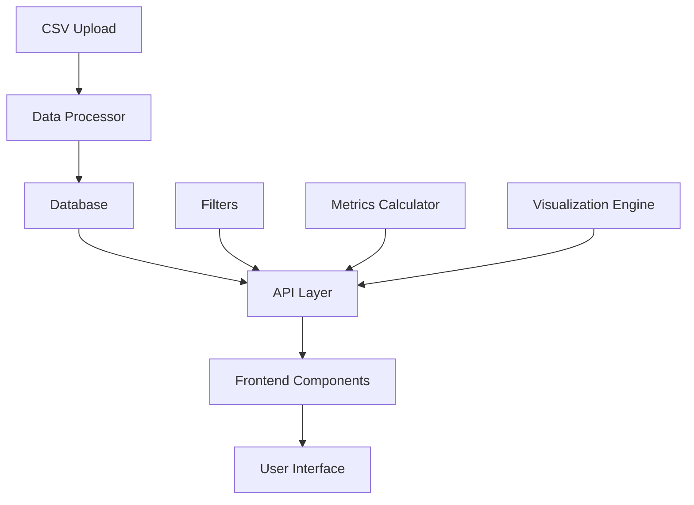

# System Architecture

## Project Structure

```
app/
├── core/
│   ├── auth.py           # Authentication logic
│   ├── routes.py         # Core route handlers
│   └── settings.py       # Application settings
├── extensions.py         # Flask extensions
├── models/              # Core models
│   ├── __init__.py
│   ├── store.py
│   ├── user.py
│   └── user_store.py
├── modules/             # Feature modules
│   ├── advertising/     # Advertising report module
│   ├── business/        # Business report module
│   ├── inventory/       # Inventory report module
│   ├── returns/         # Return report module
│   └── upload_csv/      # CSV processing module
├── static/             # Static assets
│   ├── css/
│   ├── js/
│   └── images/
└── templates/          # HTML templates
    ├── auth/
    ├── dashboard/
    └── reports/
```

## Core Architecture

### 1. Data Flow Architecture


### 2. Module Structure
Each feature module follows this enhanced structure:
```
module_name/
├── __init__.py         # Module initialization
├── constants.py        # Module-specific constants
├── models/            # Database models
│   ├── __init__.py
│   └── entities.py
├── schemas/           # Data validation schemas
│   ├── __init__.py
│   └── validators.py
├── services/         # Business logic
│   ├── __init__.py
│   ├── processor.py  # Data processing
│   ├── calculator.py # Metrics calculation
│   └── analyzer.py   # Data analysis
├── api/             # API endpoints
│   ├── __init__.py
│   ├── routes.py
│   └── handlers.py
├── utils/           # Utility functions
│   ├── __init__.py
│   └── helpers.py
└── ui/             # Frontend components
    ├── components/
    ├── stores/
    └── composables/
```

## Core Components

### 1. Data Processing Layer
- **CSV Processor**: Handles file uploads and data validation
- **Data Transformer**: Converts raw data into structured format
- **Data Validator**: Ensures data integrity and format

### 2. Business Logic Layer
- **Metrics Calculator**: Computes key performance indicators
- **Analysis Engine**: Performs trend analysis and predictions
- **Filter Manager**: Handles complex data filtering

### 3. Visualization Layer
- **Chart Generator**: Creates dynamic visualizations
- **Dashboard Builder**: Assembles metrics and charts
- **Export Engine**: Generates reports in various formats

### 4. Common Features Across All Reports

#### a) Standard Filter Interface
```typescript
interface FilterOptions {
    dateRange: {
        start: Date;
        end: Date;
    };
    granularity: 'day' | 'week' | 'month';
    dimensions: string[];
    metrics: string[];
    compareTo?: {
        start: Date;
        end: Date;
    };
}
```

#### b) Metrics Framework
```typescript
interface MetricDefinition {
    id: string;
    name: string;
    calculation: (data: any[]) => number;
    format: string;
    compareWith?: string;
    trend?: boolean;
}
```

#### c) Chart Configuration
```typescript
interface ChartConfig {
    type: 'line' | 'bar' | 'pie';
    metrics: string[];
    dimensions: string[];
    options: {
        stacked?: boolean;
        percentage?: boolean;
        comparison?: boolean;
    };
}
```

## Data Flow Process

1. **Data Input**
   - CSV file upload
   - API data ingestion
   - Manual data entry

2. **Processing Pipeline**
   ```mermaid
   graph LR
       A[Raw Data] --> B[Validation]
       B --> C[Transformation]
       C --> D[Storage]
       D --> E[Cache]
   ```

3. **Analysis Flow**
   ```mermaid
   graph LR
       A[Data Request] --> B[Filter Application]
       B --> C[Metric Calculation]
       C --> D[Visualization]
       D --> E[UI Render]
   ```

## Performance Considerations

1. **Data Loading**
   - Implement pagination
   - Use lazy loading
   - Cache frequently accessed data

2. **Computation**
   - Pre-calculate common metrics
   - Use worker threads for heavy calculations
   - Implement request debouncing

3. **Memory Management**
   - Chunk large datasets
   - Clean up unused resources
   - Optimize memory usage in visualizations

## Security Measures

1. **Data Access**
   - Role-based access control
   - Data encryption at rest
   - Secure API endpoints

2. **Input Validation**
   - Sanitize all inputs
   - Validate file uploads
   - Prevent SQL injection

## Error Handling

1. **Graceful Degradation**
   - Fallback UI components
   - Retry mechanisms
   - User-friendly error messages

2. **Logging**
   - Error tracking
   - Performance monitoring
   - User activity logging

## Testing Strategy

1. **Unit Tests**
   - Service layer testing
   - Component testing
   - Utility function testing

2. **Integration Tests**
   - API endpoint testing
   - Data flow testing
   - Cross-module interaction testing

3. **End-to-End Tests**
   - User flow testing
   - Performance testing
   - Security testing

## Technology Stack

### Backend
- Python 3.12
- Flask Web Framework
- SQLAlchemy ORM
- Flask-Login for authentication
- Flask-Bcrypt for password hashing
- Pandas for data processing

### Frontend
- HTML5/CSS3
- JavaScript (ES6+)
- Chart.js for visualizations
- TailwindCSS for styling
- Alpine.js for interactivity

### Database
- SQLite (Development)
- PostgreSQL (Production)
- SQLAlchemy migrations

### Testing
- pytest
- pytest-flask
- pytest-cov for coverage
- Factory Boy for fixtures

## Security Features

### Authentication
- Secure password hashing
- Session management
- CSRF protection
- Rate limiting

### Data Protection
- Input validation
- SQL injection prevention
- XSS protection
- CORS configuration

### Access Control
- Role-based permissions
- Store-level isolation
- API authentication
- Resource authorization

## Performance Optimizations

### Database
- Indexed queries
- Efficient relationships
- Query optimization
- Connection pooling

### Caching
- Response caching
- Query result caching
- Static file caching
- Session storage

### Processing
- Async file processing
- Chunked data handling
- Background tasks
- Rate limiting

## Error Handling

### Validation Errors
- Input validation
- File format checking
- Data type verification
- Business rule validation

### System Errors
- Database errors
- File system errors
- Network errors
- Third-party service errors

### User Feedback
- Clear error messages
- Validation feedback
- Progress indicators
- Status updates

## Monitoring and Logging

### Application Logs
- Error logging
- Access logging
- Performance metrics
- Security events

### Metrics
- Response times
- Error rates
- Resource usage
- User activity

### Alerts
- Error thresholds
- Performance degradation
- Security incidents
- System health

## Deployment

### Environment Configuration
- Development
- Testing
- Staging
- Production

### Dependencies
- Python packages
- System libraries
- Frontend assets
- Database migrations

### Server Setup
- WSGI configuration
- Nginx setup
- SSL/TLS
- Database configuration
